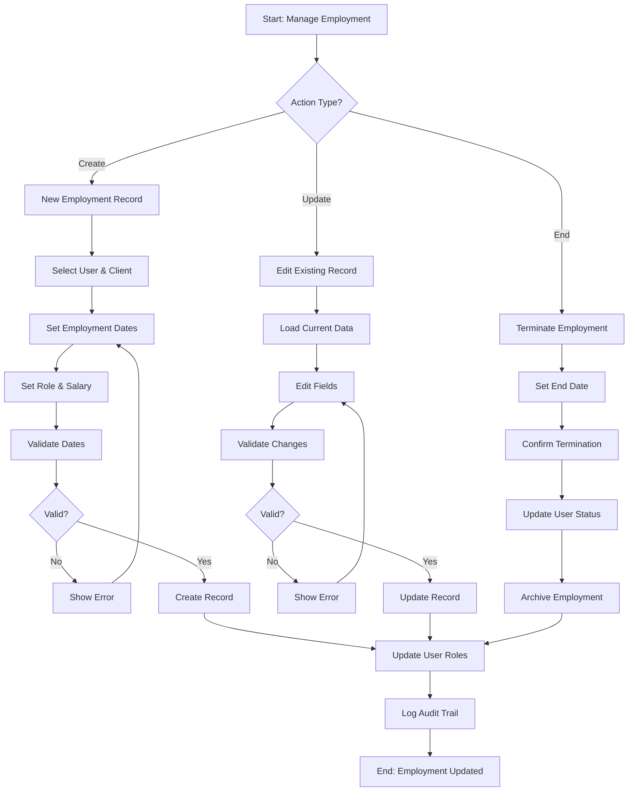

# Teamified Team Member Portal - User Management System UI/UX Specification

## Introduction

This document defines the user experience goals, information architecture, user flows, and visual design specifications for the Teamified Team Member Portal's user management interface. It serves as the foundation for visual design and frontend development, ensuring a cohesive and user-centered experience for managing users, clients, employment records, and roles.

### Overall UX Goals & Principles

#### Target User Personas

**System Administrators:**
- Technical professionals who need full system access and control
- Require efficient bulk operations, advanced filtering, and comprehensive reporting
- Need to manage user lifecycles, role assignments, and system configuration

**HR Managers:**
- Human resources professionals managing employee data and employment records
- Focus on user onboarding, role management, and compliance tracking
- Need intuitive workflows for common HR tasks

**Client Users:**
- External clients who need to manage their team members and view employment data
- Require clean, focused interfaces showing only relevant information
- Need simple approval workflows for timesheets and leave requests

**Team Members (EORs):**
- Employees who need to view and update their own profile information
- Require self-service capabilities for profile management
- Need clear visibility into their employment status and salary history

**Candidates:**
- Potential employees in the recruitment pipeline
- Need simple profile creation and status tracking
- Require clear communication about their application status

#### Usability Goals

- **Efficiency for Power Users:** Administrators can complete bulk operations and complex queries within 3 clicks
- **Clarity for All Users:** Every user type can understand their available actions and current status
- **Error Prevention:** Destructive actions require confirmation with clear consequences
- **Progressive Disclosure:** Complex features are revealed based on user role and context
- **Consistent Patterns:** All CRUD operations follow the same interaction patterns

#### Design Principles

1. **Role-Based Simplicity** - Show only relevant information and actions for each user type
2. **Data Integrity First** - Prevent errors through clear validation and confirmation patterns
3. **Efficient Bulk Operations** - Enable power users to manage multiple records simultaneously
4. **Clear Status Communication** - Always show current state and available next actions
5. **Accessible by Default** - Design for all users with proper contrast, keyboard navigation, and screen reader support

### Change Log

| Date | Version | Description | Author |
|------|---------|-------------|---------|
| 2024-12-19 | 1.0 | Initial specification creation | UX Expert Sally |

## Information Architecture (IA)

### Site Map / Screen Inventory

### Navigation Structure

**Primary Navigation:** 
- **Dashboard** - Overview and quick actions
- **Users** - User management and profiles
- **Clients** - Client management and relationships
- **Employment** - Employment records and salary management
- **Reports** - Analytics and audit trails
- **Settings** - System configuration and role management

**Secondary Navigation:**
- **User List** - Search, filter, and manage users
- **Bulk Operations** - Mass actions and imports
- **Role Management** - Assign and manage user roles
- **Audit Logs** - Track all system changes

**Breadcrumb Strategy:**
- Always show current location: Dashboard > Users > John Doe > Employment Records
- Include action context: Dashboard > Users > Bulk Operations > Import CSV
- Show user type context: Dashboard > Clients > Acme Corp > Team Members

## User Flows

### User Onboarding Flow

**User Goal:** Create a new user and establish their initial employment relationship

**Entry Points:** 
- Admin dashboard "Add User" button
- Bulk import from CSV
- Client request for new team member

**Success Criteria:** 
- User record created with complete profile information
- Employment record established with client relationship
- Appropriate roles assigned based on user type
- Salary history initialized

**Edge Cases & Error Handling:**
- Duplicate email addresses - show validation error with suggestion
- Missing required fields - highlight specific fields with clear error messages
- Employment record conflicts - warn about overlapping dates
- Role assignment failures - provide clear error and retry option
- Email delivery failures - show warning but allow user creation

**Notes:** This flow handles the complex user lifecycle from candidate to employed team member, ensuring all necessary relationships are established.

### Employment Record Management Flow

**User Goal:** Manage employment relationships, including transitions and salary changes

**Entry Points:**
- User profile employment section
- Employment records list
- Client team member management

**Success Criteria:**
- Employment record created/updated with proper validation
- Salary history maintained with audit trail
- User roles updated based on employment status
- All stakeholders notified of changes

**Edge Cases & Error Handling:**
- Overlapping employment dates - prevent creation with clear explanation
- Salary changes without effective date - require date selection
- Termination of active employment - require confirmation and reason
- Role conflicts - validate role assignments against employment status
- Concurrent edits - detect and handle conflicts gracefully

**Notes:** This flow ensures data integrity while supporting the complex employment lifecycle in your multi-tenant system.

### Bulk Operations Flow

**User Goal:** Perform mass operations on multiple users efficiently

**Entry Points:**
- User list with selected items
- Bulk operations menu
- Import/export tools

**Success Criteria:**
- Multiple users processed efficiently
- Clear progress indication and results
- Error handling for individual failures
- Audit trail for all changes

**Edge Cases & Error Handling:**
- Partial import failures - show detailed error report with row numbers
- Permission conflicts - highlight users that can't be modified
- Large dataset processing - show progress bar and allow cancellation
- Network timeouts - provide retry mechanism
- Invalid CSV format - show specific validation errors

**Notes:** This flow is critical for administrative efficiency, handling the complex validation and error reporting needed for bulk operations.

## Wireframes & Mockups

### Design Files
**Primary Design Files:** [Figma Design System](https://figma.com/teamified-user-management) - *To be created*

### Key Screen Layouts

#### User Management Dashboard
**Purpose:** Central hub for user management operations with role-based access

**Key Elements:**
- Quick stats cards (Total Users, Active EORs, Pending Candidates)
- Recent activity feed
- Quick action buttons (Add User, Bulk Import, Generate Report)
- Role-based navigation shortcuts

**Interaction Notes:** 
- Stats update in real-time
- Quick actions adapt based on user permissions
- Activity feed shows relevant actions for current user's scope

**Design File Reference:** *Dashboard Frame - To be created*

#### User List View
**Purpose:** Comprehensive user management with advanced filtering and bulk operations

**Key Elements:**
- Advanced search and filter panel
- Sortable data table with customizable columns
- Bulk selection checkboxes
- Action toolbar for bulk operations
- Pagination with customizable page sizes

**Interaction Notes:**
- Filters persist across sessions
- Table columns can be reordered and hidden
- Bulk actions show confirmation dialogs
- Real-time search with debouncing

**Design File Reference:** *User List Frame - To be created*

#### User Detail View
**Purpose:** Complete user profile management with employment and role information

**Key Elements:**
- Tabbed interface (Profile, Employment, Roles, Salary History, Audit)
- Inline editing capabilities
- Related records sidebar
- Action buttons for user-specific operations
- Status indicators and badges

**Interaction Notes:**
- Tabs load content dynamically
- Inline editing with auto-save
- Related records update in real-time
- Confirmation required for destructive actions

**Design File Reference:** *User Detail Frame - To be created*

#### Employment Record Form
**Purpose:** Create and edit employment relationships with validation

**Key Elements:**
- Multi-step form wizard
- Date picker with validation
- Client selection dropdown
- Role assignment interface
- Salary input with currency formatting
- Validation error display

**Interaction Notes:**
- Form validates on blur and submit
- Date conflicts show immediate warnings
- Client selection filters based on permissions
- Salary changes require effective date

**Design File Reference:** *Employment Form Frame - To be created*

## Component Library / Design System

### Design System Approach
**Design System Approach:** Create a custom design system based on modern UI patterns, optimized for data-heavy administrative interfaces with strong accessibility support.

### Core Components

#### DataTable Component
**Purpose:** Display and manage tabular data with advanced functionality

**Variants:** 
- Basic (read-only)
- Interactive (with selection)
- Editable (inline editing)
- Bulk operations (with checkboxes)

**States:**
- Loading (skeleton rows)
- Empty (no data message)
- Error (retry option)
- Filtered (showing subset)

**Usage Guidelines:**
- Use for any list of records
- Always include loading states
- Provide clear empty states
- Support keyboard navigation

#### UserCard Component
**Purpose:** Display user information in card format

**Variants:**
- Compact (list view)
- Detailed (profile view)
- Summary (dashboard widget)

**States:**
- Active (normal display)
- Inactive (dimmed)
- Selected (highlighted)
- Loading (skeleton)

**Usage Guidelines:**
- Show essential information only
- Include status indicators
- Support click actions
- Maintain consistent sizing

#### FormField Component
**Purpose:** Standardized form input with validation

**Variants:**
- Text input
- Email input
- Date picker
- Dropdown select
- Multi-select
- File upload

**States:**
- Default
- Focused
- Filled
- Error
- Disabled
- Loading

**Usage Guidelines:**
- Always include labels
- Show validation errors clearly
- Support keyboard navigation
- Provide helpful placeholder text

#### StatusBadge Component
**Purpose:** Display user and record status information

**Variants:**
- User status (Active, Inactive, Archived)
- Employment status (Active, Completed, Terminated)
- Role badges (Admin, EOR, Candidate, Client)

**States:**
- Active (green)
- Inactive (gray)
- Warning (yellow)
- Error (red)

**Usage Guidelines:**
- Use consistent colors
- Include tooltips for clarity
- Support screen readers
- Keep text concise

#### BulkActionBar Component
**Purpose:** Handle bulk operations on selected items

**Variants:**
- User management
- Employment records
- Role assignments

**States:**
- Hidden (no selection)
- Visible (items selected)
- Processing (operation in progress)
- Complete (results shown)

**Usage Guidelines:**
- Show selection count
- Provide clear action labels
- Include confirmation dialogs
- Show progress indicators

## Branding & Style Guide

### Visual Identity
**Brand Guidelines:** [Teamified Brand Guidelines](https://brand.teamified.com) - *To be referenced*

### Color Palette

| Color Type | Hex Code | Usage |
|------------|----------|-------|
| Primary | #2563EB | Primary buttons, links, active states |
| Secondary | #64748B | Secondary actions, borders |
| Accent | #7C3AED | Highlights, notifications |
| Success | #059669 | Success messages, positive actions |
| Warning | #D97706 | Warnings, caution states |
| Error | #DC2626 | Errors, destructive actions |
| Neutral | #F8FAFC, #E2E8F0, #64748B, #1E293B | Backgrounds, borders, text |

### Typography

#### Font Families
- **Primary:** Inter (clean, modern, excellent readability)
- **Secondary:** Inter (consistent with primary)
- **Monospace:** JetBrains Mono (code, data display)

#### Type Scale

| Element | Size | Weight | Line Height |
|---------|------|--------|-------------|
| H1 | 2.25rem (36px) | 700 | 1.2 |
| H2 | 1.875rem (30px) | 600 | 1.3 |
| H3 | 1.5rem (24px) | 600 | 1.4 |
| Body | 1rem (16px) | 400 | 1.6 |
| Small | 0.875rem (14px) | 400 | 1.5 |

### Iconography
**Icon Library:** Lucide React (consistent, accessible, comprehensive)

**Usage Guidelines:**
- Use consistent icon sizes (16px, 20px, 24px)
- Provide meaningful alt text
- Use icons to support text, not replace it
- Maintain consistent stroke width

### Spacing & Layout
**Grid System:** 12-column CSS Grid with 24px gutters

**Spacing Scale:** 4px base unit (4px, 8px, 12px, 16px, 24px, 32px, 48px, 64px)

## Accessibility Requirements

### Compliance Target
**Standard:** WCAG 2.1 AA compliance

### Key Requirements

**Visual:**
- Color contrast ratios: 4.5:1 for normal text, 3:1 for large text
- Focus indicators: 2px solid outline with 2px offset
- Text sizing: Minimum 16px base size, scalable to 200%

**Interaction:**
- Keyboard navigation: Full functionality via keyboard
- Screen reader support: Proper ARIA labels and semantic HTML
- Touch targets: Minimum 44px touch target size

**Content:**
- Alternative text: Descriptive alt text for all images
- Heading structure: Logical heading hierarchy (H1-H6)
- Form labels: Clear, descriptive labels for all form inputs

### Testing Strategy
- Automated testing with axe-core
- Manual keyboard navigation testing
- Screen reader testing with NVDA/JAWS
- Color contrast validation
- User testing with accessibility needs

## Responsiveness Strategy

### Breakpoints

| Breakpoint | Min Width | Max Width | Target Devices |
|------------|-----------|-----------|----------------|
| Mobile | 320px | 767px | Smartphones |
| Tablet | 768px | 1023px | Tablets, small laptops |
| Desktop | 1024px | 1439px | Laptops, desktops |
| Wide | 1440px | - | Large monitors |

### Adaptation Patterns

**Layout Changes:**
- Mobile: Single column, stacked navigation
- Tablet: Two-column layout, collapsible sidebar
- Desktop: Three-column layout, persistent sidebar
- Wide: Four-column layout, expanded sidebar

**Navigation Changes:**
- Mobile: Hamburger menu, bottom navigation
- Tablet: Collapsible sidebar, top navigation
- Desktop: Persistent sidebar, breadcrumbs
- Wide: Expanded sidebar, full navigation

**Content Priority:**
- Mobile: Essential information only, progressive disclosure
- Tablet: Core functionality, simplified interfaces
- Desktop: Full functionality, comprehensive views
- Wide: Enhanced layouts, additional information panels

**Interaction Changes:**
- Mobile: Touch-optimized, larger targets
- Tablet: Hybrid touch/mouse interactions
- Desktop: Mouse-optimized, hover states
- Wide: Enhanced interactions, keyboard shortcuts

## Animation & Micro-interactions

### Motion Principles
- **Purposeful:** Every animation serves a functional purpose
- **Subtle:** Enhance without distracting from content
- **Consistent:** Use consistent timing and easing
- **Accessible:** Respect reduced motion preferences

### Key Animations
- **Page Transitions:** Fade in/out (Duration: 200ms, Easing: ease-in-out)
- **Loading States:** Skeleton animations (Duration: 1.5s, Easing: ease-in-out)
- **Form Validation:** Shake on error (Duration: 300ms, Easing: ease-out)
- **Success Feedback:** Checkmark animation (Duration: 400ms, Easing: ease-out)
- **Hover States:** Subtle scale/color changes (Duration: 150ms, Easing: ease-out)
- **Modal Appearance:** Scale and fade (Duration: 200ms, Easing: ease-out)

## Performance Considerations

### Performance Goals
- **Page Load:** < 2 seconds initial load
- **Interaction Response:** < 100ms for user interactions
- **Animation FPS:** 60fps for all animations

### Design Strategies
- Lazy load non-critical content
- Optimize images and icons
- Use efficient data loading patterns
- Minimize layout shifts
- Implement progressive enhancement

## Next Steps

### Immediate Actions
1. Create detailed Figma designs based on this specification
2. Develop component library in React/TypeScript
3. Implement accessibility testing framework
4. Create user testing plan for key workflows
5. Establish design system documentation

### Design Handoff Checklist
- [x] All user flows documented
- [x] Component inventory complete
- [x] Accessibility requirements defined
- [x] Responsive strategy clear
- [x] Brand guidelines incorporated
- [x] Performance goals established
- [ ] Visual designs created in Figma
- [ ] Component specifications detailed
- [ ] User testing plan developed
- [ ] Development handoff prepared

---

*This specification serves as the foundation for creating intuitive, accessible, and efficient user management interfaces that support the complex workflows and data relationships in the Teamified Team Member Portal.*
