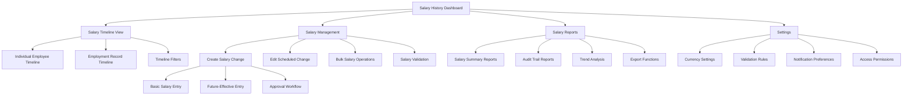
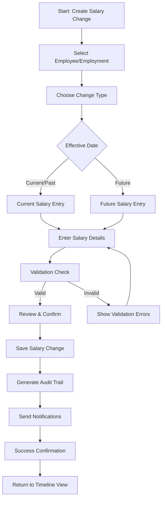
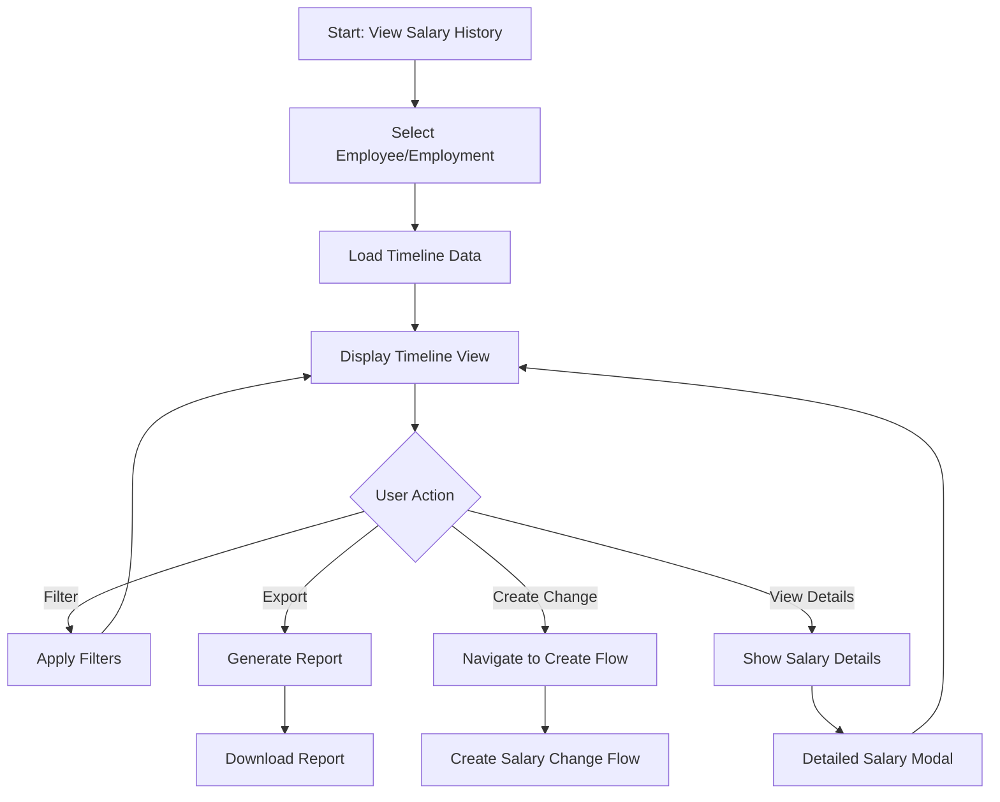
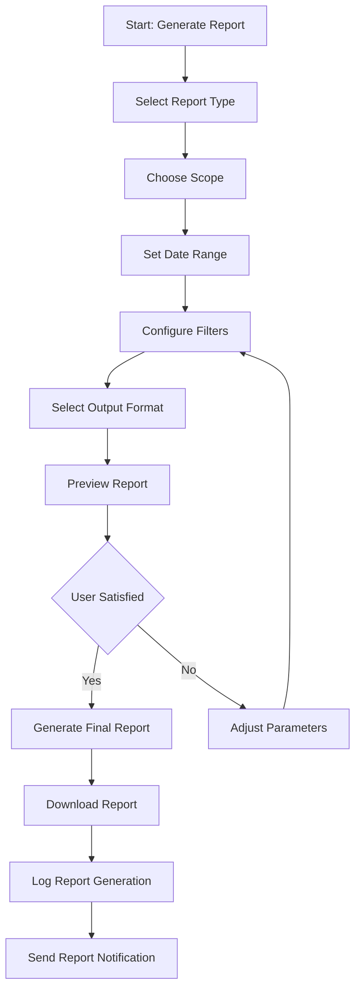

# Teamified EOR Portal UI/UX Specification - Salary History Management

This document defines the user experience goals, information architecture, user flows, and visual design specifications for Teamified EOR Portal's Salary History Management interface. It serves as the foundation for visual design and frontend development, ensuring a cohesive and user-centered experience for managing employee salary changes, tracking salary history, and providing comprehensive salary reporting.

## Overall UX Goals & Principles

### Target User Personas

**Primary: System Administrator**
- **Needs:** Complete control over salary data, audit compliance, comprehensive reporting
- **Pain Points:** Complex salary change workflows, ensuring data integrity, regulatory compliance
- **Goals:** Efficient salary management, complete audit trails, error prevention

**Secondary: HR Manager**
- **Needs:** Intuitive salary change creation, employee salary overview, approval workflows
- **Pain Points:** Time-consuming salary entry, tracking salary changes, employee communication
- **Goals:** Streamlined salary processes, clear employee salary visibility, automated notifications

**Tertiary: HR Staff**
- **Needs:** Basic salary entry, simple reporting, guided workflows
- **Pain Points:** Complex interfaces, data entry errors, unclear processes
- **Goals:** Simple, guided salary management, clear validation, minimal training required

### Usability Goals

- **Efficiency of Use:** HR managers can create salary changes in under 2 minutes
- **Error Prevention:** Clear validation prevents invalid salary entries and future date conflicts
- **Audit Clarity:** System administrators can trace any salary change to its source within 30 seconds
- **Learnability:** New HR staff can complete basic salary tasks without training
- **Accessibility:** Interface meets WCAG 2.1 AA standards for all users
- **Data Integrity:** Immutable salary records with clear visual indicators

### Design Principles

1. **Clarity Over Complexity** - Present salary data in clear, scannable formats with minimal cognitive load
2. **Trust Through Transparency** - Make all salary changes and their sources immediately visible
3. **Progressive Disclosure** - Show essential salary info first, details on demand
4. **Immediate Feedback** - Every salary action provides instant confirmation and validation
5. **Future-Ready Design** - Clearly distinguish between current and scheduled salary changes

### Change Log

| Date | Version | Description | Author |
|------|---------|-------------|---------|
| 2024-12-19 | 1.0 | Initial frontend specification creation | UX Expert Sally |

## Information Architecture (IA)

### Site Map / Screen Inventory

### Navigation Structure

**Primary Navigation:** 
- **Dashboard** - Overview of all salary activities and key metrics
- **Timeline** - Visual salary history for employees and employment records
- **Manage** - Create, edit, and approve salary changes
- **Reports** - Generate salary reports and analytics
- **Settings** - Configure salary management preferences

**Secondary Navigation:**
- **Breadcrumb Navigation** - Shows current location: Dashboard > Timeline > [Employee Name]
- **Quick Actions Panel** - Floating action button for "Create Salary Change"
- **Filter Panel** - Collapsible sidebar for date range, employment, and status filters
- **Search Bar** - Global search for employees, employment records, and salary amounts

**Breadcrumb Strategy:**
- **Level 1:** Salary History (always visible)
- **Level 2:** Current section (Dashboard/Timeline/Manage/Reports)
- **Level 3:** Specific employee or employment record
- **Level 4:** Individual salary change or report detail

## User Flows

### Flow 1: Create Salary Change

**User Goal:** Add a new salary change for an employee with proper validation and audit trail

**Entry Points:**
- Salary Dashboard "Create Salary Change" button
- Employee Timeline "Add Salary Change" action
- Employment Record "Salary History" tab
- Quick Actions floating button

**Success Criteria:**
- Salary change successfully created with validation
- Audit trail automatically generated
- User receives confirmation
- Change appears in timeline view

**Flow Diagram:**

**Edge Cases & Error Handling:**
- Invalid employment record ID
- Duplicate effective date for same employment
- Future date beyond 1-year limit
- Invalid currency code
- Negative salary amount
- Network connectivity issues
- Insufficient permissions

**Notes:** Future-effective changes require special visual indicators and approval workflows per Story 1.5 requirements.

### Flow 2: View Salary History Timeline

**User Goal:** Review complete salary history for an employee or employment record

**Entry Points:**
- Employee search results
- Employment record details
- Salary dashboard employee cards
- Direct URL navigation

**Success Criteria:**
- Complete salary timeline displayed
- Clear distinction between current and scheduled changes
- Easy navigation between different employment periods
- Export and reporting options available

**Flow Diagram:**

**Edge Cases & Error Handling:**
- No salary history found
- Large datasets requiring pagination
- Mixed currency displays
- Scheduled changes becoming active
- Access permission restrictions

**Notes:** Timeline must clearly distinguish between active and scheduled salary changes with appropriate visual indicators.

### Flow 3: Generate Salary Reports

**User Goal:** Create comprehensive salary reports for audit or analysis purposes

**Entry Points:**
- Reports section main navigation
- Employee timeline "Generate Report" action
- Dashboard "Quick Reports" panel
- Bulk operations from salary management

**Success Criteria:**
- Report generated with requested data
- Export in desired format (PDF, Excel, CSV)
- Report includes proper audit information
- User can schedule recurring reports

**Flow Diagram:**

**Edge Cases & Error Handling:**
- No data found for selected criteria
- Large report generation timeouts
- Export format compatibility issues
- Insufficient permissions for certain data
- Report generation failures

**Notes:** Reports must include audit trail information and support both individual employee and system-wide reporting.

## Wireframes & Mockups

### Design Files

**Primary Design Files:** 
- **Design System:** Material-UI based design system with Teamified brand guidelines (to be implemented by dev agent)
- **Component Library:** Custom salary management components built from specification (to be implemented by dev agent)
- **Implementation Approach:** Direct implementation based on this specification without separate design files

### Key Screen Layouts

**Screen 1: Salary History Dashboard**

**Purpose:** Provide overview of salary activities, key metrics, and quick access to common tasks

**Key Elements:**
- **Header:** Navigation breadcrumb, user profile, notifications
- **Quick Stats Cards:** Total employees, pending changes, upcoming salary changes, audit alerts
- **Recent Activity Feed:** Latest salary changes with employee names and amounts
- **Quick Actions Panel:** Create salary change, generate report, view timeline
- **Employee Search:** Global search with autocomplete for employee/employment records
- **Upcoming Changes Alert:** Scheduled salary changes becoming active soon

**Interaction Notes:**
- Cards are clickable and navigate to relevant sections
- Search provides real-time results with employee photos and current salary
- Quick actions use floating action button pattern for mobile compatibility
- Recent activity items expand to show full details on hover/click

**Implementation Reference:** Direct implementation based on this specification

**Screen 2: Salary Timeline View**

**Purpose:** Visual timeline showing complete salary history for selected employee or employment record

**Key Elements:**
- **Employee Header:** Photo, name, current employment, current salary
- **Timeline Navigation:** Date range selector, zoom controls, filter options
- **Timeline Visualization:** Material-UI Timeline component with salary markers
- **Salary Detail Panels:** Expandable cards showing salary change details
- **Status Indicators:** Current (green), scheduled (blue), historical (gray) salary markers
- **Action Buttons:** Add salary change, edit scheduled change, generate report
- **Currency Toggle:** Switch between different currency displays

**Interaction Notes:**
- Timeline scrolls horizontally with smooth animations
- Salary markers show amount and effective date on hover
- Click on marker opens detailed salary change modal
- Scheduled changes have special styling and "pending" indicators
- Timeline supports keyboard navigation for accessibility

**Implementation Reference:** Direct implementation based on this specification

**Screen 3: Create Salary Change Form**

**Purpose:** Guided form for creating new salary changes with validation and confirmation

**Key Elements:**
- **Employee Selection:** Searchable dropdown with current salary display
- **Salary Details Section:** Amount input, currency selector, effective date picker
- **Change Reason:** Dropdown with common reasons + custom option
- **Future Date Warning:** Special alert for future-effective changes
- **Validation Messages:** Real-time validation with clear error states
- **Review Panel:** Summary of change with impact preview
- **Action Buttons:** Save, Save & Create Another, Cancel
- **Approval Workflow:** If required, shows approval request interface

**Interaction Notes:**
- Form validates in real-time with clear error messaging
- Future dates show special warning and approval requirements
- Currency changes update amount formatting automatically
- Review panel updates as user makes changes
- Form supports keyboard navigation and screen readers

**Implementation Reference:** Direct implementation based on this specification

**Screen 4: Salary Reports Interface**

**Purpose:** Comprehensive reporting interface for salary analytics and audit trails

**Key Elements:**
- **Report Type Selector:** Individual employee, employment record, system-wide reports
- **Filter Panel:** Date range, employee selection, employment status, currency
- **Report Preview:** Live preview of report data with pagination
- **Export Options:** PDF, Excel, CSV format selection
- **Report Templates:** Saved report configurations for quick generation
- **Scheduled Reports:** Set up recurring report generation
- **Audit Information:** Report generation timestamp, user, and data source

**Interaction Notes:**
- Filters update preview in real-time
- Report generation shows progress indicator
- Export options include formatting preferences
- Templates can be saved and shared with other users
- Scheduled reports show next generation time

**Implementation Reference:** Direct implementation based on this specification

## Component Library / Design System

### Design System Approach

**Design System Approach:** Extend existing Material-UI design system with custom salary-specific components while maintaining consistency with Teamified's established design language. Use Material-UI as the foundation and create specialized components for salary management workflows.

### Core Components

**Component 1: SalaryTimeline**

**Purpose:** Visual timeline component for displaying salary history with clear status indicators

**Variants:** 
- **Compact:** Horizontal timeline for dashboard views
- **Detailed:** Full timeline with expandable salary details
- **Print:** Optimized for report generation and printing

**States:**
- **Loading:** Skeleton loader with timeline structure
- **Empty:** No salary history message with call-to-action
- **Error:** Error state with retry option
- **Interactive:** Hover states, click interactions, keyboard navigation

**Usage Guidelines:**
- Always show current salary prominently
- Use color coding: green (current), blue (scheduled), gray (historical)
- Include effective date and amount on timeline markers
- Support keyboard navigation and screen reader accessibility
- Handle large datasets with virtualization

**Component 2: SalaryChangeForm**

**Purpose:** Comprehensive form for creating and editing salary changes with validation

**Variants:**
- **Create:** New salary change creation
- **Edit:** Modify scheduled salary changes (future dates only)
- **Quick:** Simplified form for common salary adjustments
- **Bulk:** Multiple salary changes in single form

**States:**
- **Default:** Empty form with validation placeholders
- **Validating:** Real-time validation feedback
- **Error:** Validation errors with specific field highlighting
- **Submitting:** Loading state with disabled inputs
- **Success:** Confirmation state with next action options

**Usage Guidelines:**
- Validate in real-time with clear error messaging
- Show currency formatting as user types
- Handle future dates with special approval workflow
- Include change reason validation
- Support keyboard navigation and form accessibility

**Component 3: SalaryCard**

**Purpose:** Display individual salary information with status and actions

**Variants:**
- **Current:** Active salary with prominent display
- **Scheduled:** Future salary with countdown or approval status
- **Historical:** Past salary with read-only information
- **Summary:** Dashboard card with key salary metrics

**States:**
- **Default:** Standard display with hover effects
- **Selected:** Highlighted state for multi-selection
- **Loading:** Skeleton state while data loads
- **Error:** Error state with retry option
- **Expanded:** Detailed view with additional information

**Usage Guidelines:**
- Use consistent color coding across all variants
- Include clear status indicators for scheduled changes
- Show currency formatting with proper locale support
- Provide appropriate actions based on salary status
- Ensure touch-friendly sizing for mobile devices

**Component 4: SalaryReportGenerator**

**Purpose:** Interface for generating and configuring salary reports

**Variants:**
- **Quick:** Pre-configured common reports
- **Custom:** Full customization with filters and formatting
- **Scheduled:** Recurring report configuration
- **Audit:** Specialized audit trail reports

**States:**
- **Configuration:** Report setup and filter selection
- **Generating:** Progress indicator with estimated time
- **Complete:** Success state with download options
- **Error:** Error handling with retry options

**Usage Guidelines:**
- Provide clear filter options with real-time preview
- Show report generation progress with time estimates
- Include export format options (PDF, Excel, CSV)
- Support report templates and saved configurations
- Ensure accessibility for all report types

**Component 5: CurrencyDisplay**

**Purpose:** Consistent currency formatting and conversion display

**Variants:**
- **Amount:** Simple currency amount display
- **Comparison:** Side-by-side currency comparison
- **Converted:** Amount with conversion to base currency
- **Range:** Currency range display for salary bands

**States:**
- **Default:** Standard currency formatting
- **Loading:** Conversion rates loading state
- **Error:** Conversion unavailable state
- **Highlighted:** Emphasis state for important amounts

**Usage Guidelines:**
- Use consistent currency formatting across all components
- Support multiple currency displays with clear labels
- Handle currency conversion with rate indicators
- Provide accessibility labels for screen readers
- Include proper locale formatting for different regions

## Branding & Style Guide

### Visual Identity

**Brand Guidelines:** Teamified EOR Portal Design System - Material-UI based with custom salary management components following established brand guidelines

### Color Palette

| Color Type | Hex Code | Usage |
|------------|----------|-------|
| Primary | #A16AE8 | Primary Purple - Main brand color, primary buttons, active states |
| Secondary | #8096FD | Brand Blue - Secondary actions, links, accent elements |
| Accent | #FF6B6B | Accent Red - Destructive actions, urgent alerts |
| Success | #4CAF50 | Positive feedback, confirmations, current salary indicators |
| Warning | #FF9800 | Cautions, important notices, pending approvals |
| Error | #F44336 | Errors, validation failures, critical alerts |
| Info | #2196F3 | Information, scheduled salary indicators, help text |
| Neutral | #757575, #BDBDBD, #F5F5F5 | Text, borders, backgrounds, disabled states |

### Typography

**Font Families:**
- **Primary:** Plus Jakarta Sans - Modern, readable sans-serif for UI text
- **Secondary:** Roboto - Material-UI default for consistency
- **Monospace:** 'Roboto Mono' - For currency amounts and technical data

**Type Scale**

| Element | Size | Weight | Line Height |
|---------|------|--------|-------------|
| H1 | 32px | 600 | 1.2 |
| H2 | 24px | 600 | 1.3 |
| H3 | 20px | 500 | 1.4 |
| H4 | 18px | 500 | 1.4 |
| Body | 16px | 400 | 1.5 |
| Small | 14px | 400 | 1.4 |
| Caption | 12px | 400 | 1.3 |

### Iconography

**Icon Library:** Material-UI Icons with custom salary-specific icons

**Usage Guidelines:**
- Use Material-UI icons for standard actions (edit, delete, save, export)
- Create custom icons for salary-specific actions (timeline, currency conversion, audit trail)
- Maintain consistent 24px size for UI icons, 16px for inline icons
- Use outlined style for primary actions, filled for active states
- Ensure all icons have proper accessibility labels

### Spacing & Layout

**Grid System:** 12-column responsive grid with 8px base unit spacing

**Spacing Scale:**
- **xs:** 4px - Tight spacing for related elements
- **sm:** 8px - Standard spacing for form elements
- **md:** 16px - Default spacing between sections
- **lg:** 24px - Spacing between major components
- **xl:** 32px - Section spacing and page margins
- **xxl:** 48px - Large section separators

## Accessibility Requirements

### Compliance Target

**Standard:** WCAG 2.1 AA compliance for all salary management interfaces

### Key Requirements

**Visual:**
- **Color contrast ratios:** Minimum 4.5:1 for normal text, 3:1 for large text and UI components
- **Focus indicators:** Clear, visible focus indicators with minimum 2px outline and high contrast
- **Text sizing:** Support text scaling up to 200% without horizontal scrolling or content loss

**Interaction:**
- **Keyboard navigation:** Full keyboard accessibility for all interactive elements including timeline navigation, form inputs, and report generation
- **Screen reader support:** Comprehensive ARIA labels, roles, and descriptions for salary data, timeline components, and form validation
- **Touch targets:** Minimum 44px touch targets for all interactive elements, with adequate spacing between clickable areas

**Content:**
- **Alternative text:** Descriptive alt text for all salary-related charts, graphs, and visual indicators
- **Heading structure:** Proper heading hierarchy (H1-H6) for salary reports and timeline sections
- **Form labels:** Clear, descriptive labels for all salary input fields with validation error association

### Testing Strategy

**Automated Testing:**
- axe-core integration for continuous accessibility testing
- Lighthouse accessibility audits in CI/CD pipeline
- Color contrast validation tools for all UI components

**Manual Testing:**
- Screen reader testing with NVDA, JAWS, and VoiceOver
- Keyboard-only navigation testing for all user flows
- High contrast mode testing for visual accessibility
- Voice control testing for hands-free operation

**User Testing:**
- Testing with users who rely on assistive technologies
- Validation of salary data accessibility for users with visual impairments
- Timeline navigation testing with keyboard-only users

## Responsiveness Strategy

### Breakpoints

| Breakpoint | Min Width | Max Width | Target Devices |
|------------|-----------|-----------|----------------|
| Mobile | 320px | 767px | Smartphones, small tablets |
| Tablet | 768px | 1023px | Tablets, small laptops |
| Desktop | 1024px | 1439px | Laptops, desktop monitors |
| Wide | 1440px | - | Large monitors, ultrawide displays |

### Adaptation Patterns

**Layout Changes:**
- **Mobile:** Single-column layout with collapsible timeline, stacked form elements, bottom navigation
- **Tablet:** Two-column layout with sidebar navigation, condensed timeline view, side-by-side form fields
- **Desktop:** Three-column layout with full sidebar, expanded timeline, multi-column forms
- **Wide:** Four-column layout with additional data panels, full-width timeline, comprehensive dashboard view

**Navigation Changes:**
- **Mobile:** Bottom tab navigation with floating action button for quick salary creation
- **Tablet:** Collapsible sidebar with persistent primary navigation
- **Desktop:** Full sidebar navigation with breadcrumb trails and quick actions
- **Wide:** Extended sidebar with additional quick access panels and advanced filtering

**Content Priority:**
- **Mobile:** Essential salary information first, progressive disclosure for details
- **Tablet:** Balanced view with key metrics and timeline, expandable details
- **Desktop:** Comprehensive view with all information visible, detailed timeline
- **Wide:** Full dashboard with multiple data panels, advanced analytics, comprehensive reporting

**Interaction Changes:**
- **Mobile:** Touch-optimized interactions, swipe gestures for timeline navigation, large touch targets
- **Tablet:** Hybrid touch and mouse interactions, pinch-to-zoom for timeline, hover states for mouse users
- **Desktop:** Mouse-optimized interactions, keyboard shortcuts, hover states, right-click context menus
- **Wide:** Advanced keyboard shortcuts, multi-select operations, drag-and-drop functionality

## Animation & Micro-interactions

### Motion Principles

**Motion Principles:** Subtle, purposeful animations that enhance usability without distracting from critical salary data. Focus on providing clear feedback, guiding user attention, and creating smooth transitions between states. All animations should respect user preferences for reduced motion.

### Key Animations

- **Timeline Navigation:** Smooth horizontal scroll with momentum and snap-to-position (Duration: 300ms, Easing: ease-out)
- **Salary Card Hover:** Subtle lift effect with shadow increase (Duration: 200ms, Easing: ease-in-out)
- **Form Validation:** Gentle shake animation for invalid fields (Duration: 400ms, Easing: ease-in-out)
- **Status Transitions:** Color fade transitions for salary status changes (Duration: 500ms, Easing: ease-in-out)
- **Loading States:** Skeleton loading with subtle pulse animation (Duration: 1500ms, Easing: ease-in-out)
- **Modal Appearance:** Slide-up from bottom with backdrop fade (Duration: 250ms, Easing: ease-out)
- **Success Confirmation:** Checkmark animation with scale and bounce (Duration: 600ms, Easing: cubic-bezier(0.68, -0.55, 0.265, 1.55))
- **Data Updates:** Staggered appearance of new timeline items (Duration: 200ms delay between items, Easing: ease-out)
- **Filter Application:** Smooth reveal of filtered content with fade and slide (Duration: 400ms, Easing: ease-out)

## Performance Considerations

### Performance Goals

- **Page Load:** Initial salary dashboard load under 2 seconds on 3G connection
- **Interaction Response:** Timeline navigation and form interactions under 100ms response time
- **Animation FPS:** Maintain 60fps for all animations and transitions
- **Data Loading:** Salary history timeline loads within 1 second for up to 100 salary records

### Design Strategies

**Lazy Loading & Virtualization:**
- Implement virtual scrolling for large salary timelines (100+ records)
- Load salary details on-demand when user expands timeline items
- Progressive image loading for employee photos and avatars

**Caching & Optimization:**
- Cache frequently accessed salary data and employee information
- Implement smart prefetching for likely user actions (next employee, related reports)
- Use service worker for offline access to recent salary data

**Component Optimization:**
- Use React.memo for salary card components to prevent unnecessary re-renders
- Implement debounced search for employee lookup to reduce API calls
- Optimize timeline rendering with canvas-based visualization for large datasets

**Data Management:**
- Implement pagination for salary history with intelligent page size based on device
- Use optimistic updates for salary changes to provide immediate feedback
- Compress and optimize salary report generation for faster downloads

## Next Steps

### Immediate Actions

1. **Begin Frontend Development** - Start implementing salary history management interface based on this specification
2. **Build Component Library** - Develop reusable components (SalaryTimeline, SalaryChangeForm, SalaryCard, etc.) using Material-UI
3. **Implement Design System** - Apply Teamified brand guidelines and Material-UI design patterns
4. **Create Key Screens** - Build Dashboard, Timeline, Create Form, and Reports interfaces
5. **Conduct Accessibility Testing** - Test implementation with screen readers and keyboard navigation
6. **Validate with Stakeholders** - Present working interface to HR team and system administrators for feedback
7. **Iterate Based on Feedback** - Refine implementation based on user testing and stakeholder input

### Design Handoff Checklist

- [x] **All user flows documented** - Complete user flows for Create, View Timeline, and Generate Reports
- [x] **Component inventory complete** - 5 core components defined with variants and states
- [x] **Accessibility requirements defined** - WCAG 2.1 AA compliance requirements specified
- [x] **Responsive strategy clear** - Breakpoints and adaptation patterns defined for all devices
- [x] **Brand guidelines incorporated** - Teamified colors, typography, and spacing system integrated
- [x] **Performance goals established** - Load times, interaction response, and animation performance defined

## Checklist Results

*UI/UX checklist validation would be performed here once the checklist is available.*
